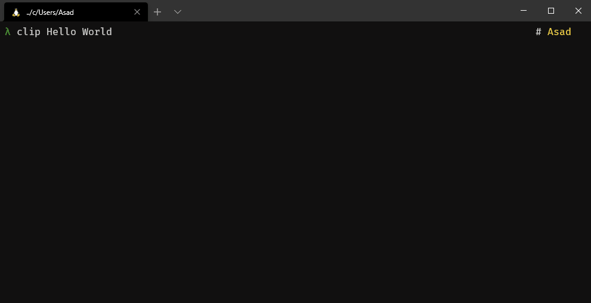
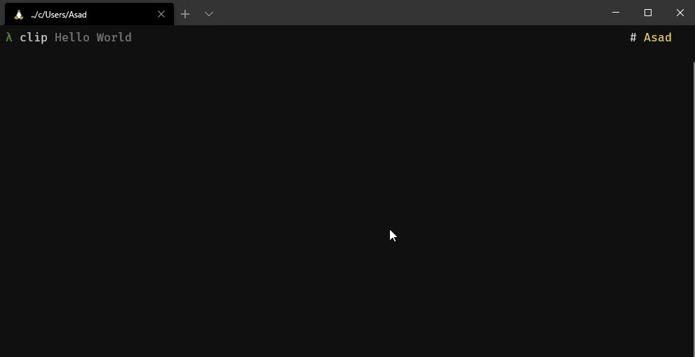
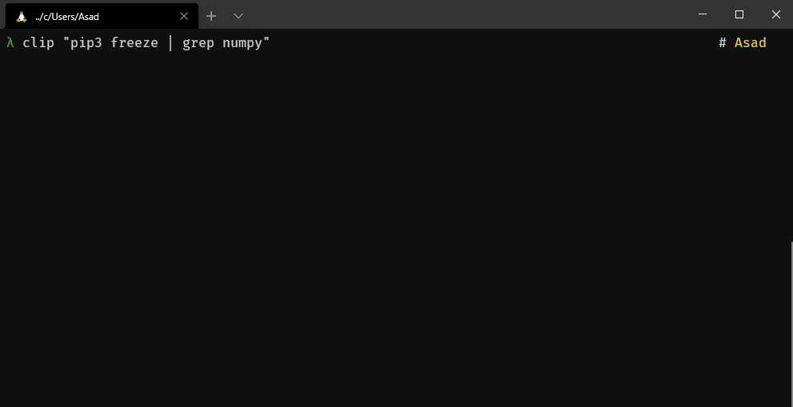
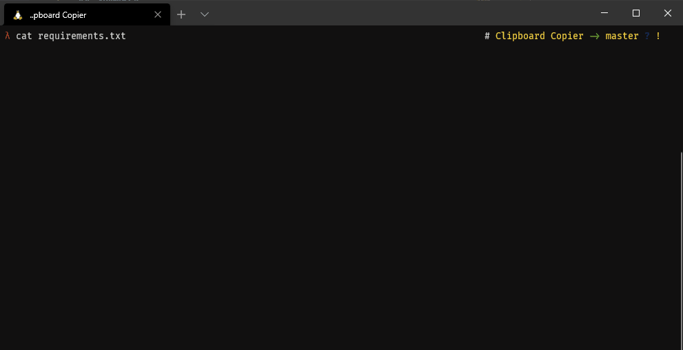

# CLIPER 

## Summary
It basically copies that is provided as its CL-Args onto the systems clipboard and can be used for furthur use.

## Features
This app has two major features
- It copies the text provided to it to the clipboard
- It can resolve complex shell commands and copy their result onto the clipboard aswell
- It can read a file's contents and copy them to the clipboard

## Usage and Working
`Usage: clip <text or shell command or file to read from>`
___

It can be used in many ways as elaborated below
- `clip Hello World`

___
- `clip "which python3"`

___

- `clip "pip3 freeze | grep numpy"` 

___

- `clip requirements.txt` 

___

## Installation
### Automated (One-Step)
    wget https://raw.githubusercontent.com/ShaderOX/Cliper/master/install.sh && sh ./install.sh && rm ./install.sh

**Note: `clip` is now aliased to perform the function. To change you have to edit the `~/.bashrc` file.** 
___
### Manual 
    git clone https://github.com/ShaderOX/Cliper.git

After having cloned it. I recommend to follow the steps below
1. Create a folder named `Custom Scripts` in `~`

        mkdir ~/Custom\ Scripts/
2. Shift the file `clip.py` to `~/Custom\ Scripts/`

        cp clip.py ~/Custom\ Scripts/
3. Edit the `~/.bashrc` file and add the following

        alias clip="python3 ~/Custom\ Scripts/clip.py"

        Note: 'clip' can be changed to any command of your choice that is not already in use.
        
4. Restart your shell and you're done!

___
### Dependencies
    pip3 install -r requirements